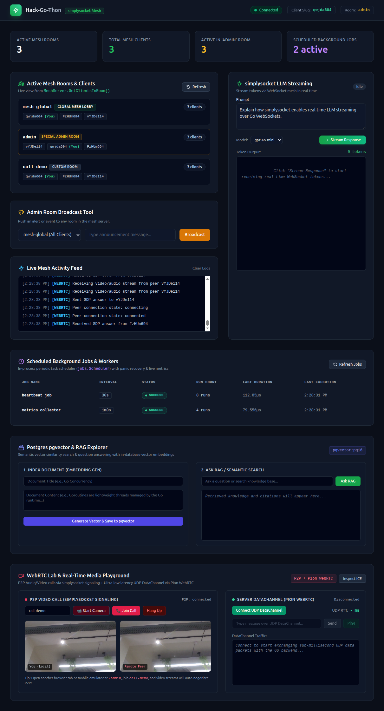

# Hack-Go-Thon 🚀

A production-grade, modular Go backend starter framework designed for rapid hackathon velocity and robust microservice development. It provides everything needed to build, demo, and ship high-performance real-time and AI-powered applications out of the box.

> 📖 **Full Technical Manual**: For comprehensive architecture diagrams, directory structure, detailed code walkthroughs, API contracts, and recipes, see [**`DOCUMENTATION.md`**](DOCUMENTATION.md).

---

## ✨ Features

- 🌐 **Real-Time WebSockets via [`simplysocket`](https://github.com/DhruvikDonga/simplysocket)**  
  High-concurrency mesh architecture based on *"Connect once, write logic multiple times"* by [Dhruvik](https://github.com/DhruvikDonga). Clients connect via a single WebSocket endpoint (`/api/v1/ws`) while business features are implemented independently through pluggable `RoomData` handlers.

- 🤖 **Real-Time LLM Token Streaming**  
  Stream model completion tokens piece-by-piece over WebSockets directly to clients using [`simplysocket`](https://github.com/DhruvikDonga/simplysocket). Includes automatic zero-dependency simulated streaming when offline or without an API key so demo velocity is never blocked.

- 🗄️ **PostgreSQL Vector DB & RAG Pipeline (`pgvector`)**  
  Native in-database vector storage using `pgvector/pgvector:pg16`. Features 1536-dimensional embeddings, an HNSW cosine similarity index (`<=>`), and ready-to-use endpoints for document indexing (`/api/v1/rag/documents`), semantic search (`/api/v1/rag/search`), and grounded Q&A (`/api/v1/rag/ask`).

- 🖥️ **Embedded Admin Control Center UI**  
  A sleek, responsive dark-mode dashboard bundled directly into the Go binary (`web/admin.html`) and served at `/admin` (and `/`). Provides live mesh room/client visualization, real-time activity feed, live LLM streaming tester, scheduled jobs monitor, an interactive RAG playground, and a live WebRTC Lab for P2P video calls and UDP DataChannels.
  

- 📹 **WebRTC Real-Time Media & Pion UDP DataChannel**  
  Built-in P2P WebRTC audio/video signaling over [`simplysocket`](https://github.com/DhruvikDonga/simplysocket), automated STUN/TURN configuration (`/api/v1/webrtc/ice-servers`), and server-side [`pion/webrtc/v4`](https://github.com/pion/webrtc) peer integration for sub-millisecond UDP DataChannel messaging and ping-pong latency benchmarks.

- ⚙️ **In-Process Job Scheduler & Workers**  
  Periodic task scheduler (`jobs.Scheduler`) with panic isolation, runtime recovery, and live execution observability (`GET /api/v1/jobs`), plus continuous background worker loops without external broker dependencies.

- 🔐 **Authentication & Security Middlewares**  
  Production-ready authentication middleware pipeline with JWT (`Bearer <token>`) validation/generation and database-backed API Key (`X-API-Key`) checking with master key bypass.

- 📊 **Audit Logging & Structured Telemetry**  
  Asynchronous PostgreSQL request audit logging (`api_calls`), high-performance Zap structured logging with console/JSON modes, and unique `X-Request-ID` correlation.

- 🩺 **Kubernetes Health Probes & Graceful Shutdown**  
  Standardized `/api/v1/health/live` and `/api/v1/health/ready` probes with dependency checking, paired with clean signal handling (`SIGINT`/`SIGTERM`) and context-aware connection draining.

- 🐳 **Docker & Container Ready**  
  Multi-stage minimal Alpine `Dockerfile` and local `docker-compose.yml` pre-configured with `pgvector/pgvector:pg16` and health check dependencies.

---

## ⚡ Quick Start

```bash
# Run locally (starts on http://localhost:8080)
make run

# Or spin up with PostgreSQL (pgvector) in Docker
make docker-up
```

Open **[http://localhost:8080/admin](http://localhost:8080/admin)** to access the live Control Center!

---

## 🤖 Agent Development & Skills

* 📖 **[SKILLS.md](./SKILLS.md)**: Authoritative architecture patterns, invariant safety rules, and step-by-step recipes for AI coding agents.
* 📚 **[DOCUMENTATION.md](./DOCUMENTATION.md)**: Deep-dive architecture reference and API schemas.

## 👤 Author

By [Dhruvik](https://dhruvik.cc)

