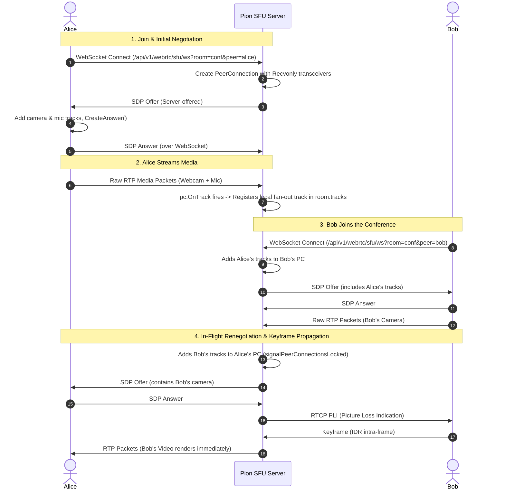

# WebRTC & SFU Architecture Guide

This document provides a comprehensive technical breakdown of how real-time media and the **Selective Forwarding Unit (SFU)** operate in the `hack-go-thon` codebase using [Pion WebRTC v4](https://github.com/pion/webrtc) and [`simplysocket`](https://github.com/DhruvikDonga/simplysocket).

---

## 1. SFU vs. Peer-to-Peer (Mesh)

WebRTC multi-party architectures generally fall into three topologies:

```
       [ Mesh (P2P) ]                         [ SFU Architecture ]
Each peer sends to everyone             Each peer sends ONE stream upstream;
 (N-1 uploads, burns uplink)             Server fans out RTP packets to all peers

    User 1 <=======> User 2                     User 1         User 2
       ^ \         / ^                             \             /
        \ \       / /                               ▼           ▼
         \ \     / /                             +-----------------+
          \  \ /  /                              |  Pion SFU Hub   |
           v  X  v                               | (Media Router)  |
            User 3                               +-----------------+
                                                          ▲
                                                          |
                                                       User 3
```

- **Mesh (1:1 P2P)**: Every participant sends their audio/video stream directly to every other participant ($N \times (N-1)$ connections). While fine for 2 peers, mobile uplink bandwidth saturates rapidly at 3+ peers.
- **Selective Forwarding Unit (SFU)**: Every participant publishes **exactly one** upstream video/audio feed to the server. The server acts as a packet router, duplicating and forwarding (fanning out) raw RTP packets to all other subscribers without decoding or re-encoding.
- **MCU (Multipoint Control Unit)**: Server decodes and mixes all streams into a single composite video. High server CPU consumption; SFU avoids this by forwarding packets directly.

---

## 2. Core Codebase Components

The SFU engine is implemented in [`internal/webrtc_server/sfu.go`](internal/webrtc_server/sfu.go):

| Structure | Location | Role & Responsibility |
| :--- | :--- | :--- |
| **`SFUEngine`** | [`sfu.go`](internal/webrtc_server/sfu.go) | Central coordinator managing active rooms, STUN/TURN configurations, and cross-subsystem event hooks. |
| **`SFURoom`** | [`sfu.go`](internal/webrtc_server/sfu.go) | Thread-safe room container holding connected `peers` map and published media `tracks` map. |
| **`SFUPeer`** | [`sfu.go`](internal/webrtc_server/sfu.go) | Represents an active participant, wrapping their Pion `*webrtc.PeerConnection`, active `senders`, and WebSocket connection. |
| **`SFUTrack`** | [`sfu.go`](internal/webrtc_server/sfu.go) | Published camera or microphone track backed by Pion's `*webrtc.TrackLocalStaticRTP`. |

---

## 3. End-to-End Connection Lifecycle



---

## 4. Technical Step-by-Step Breakdown

### 4.1. Live WebSocket Signaling Handshake
Clients connect to the live bidirectional signaling endpoint:
```
ws://<host>/api/v1/webrtc/sfu/ws?room=<room_name>&peer=<peer_slug>
```
Handled by `SFUEngine.HandleWebSocket()`:
1. Upgrades HTTP connection to WebSocket.
2. Acquires or initializes the targeted `SFURoom`.
3. Creates a new Pion `*webrtc.PeerConnection` with the configured STUN/TURN servers.

### 4.2. Inbound Media Transceiver Setup
Before exchanging SDP, the server adds two `Recvonly` transceivers:
```go
for _, typ := range []webrtc.RTPCodecType{webrtc.RTPCodecTypeVideo, webrtc.RTPCodecTypeAudio} {
    pc.AddTransceiverFromKind(typ, webrtc.RTPTransceiverInit{
        Direction: webrtc.RTPTransceiverDirectionRecvonly,
    })
}
```
This instructs Pion to allocate media lines in the SDP ready to ingest the client's camera and microphone streams.

### 4.3. Track Synchronization (`signalPeerConnectionsLocked`)
Whenever a peer joins, leaves, or publishes a track, `room.signalPeerConnectionsLocked()` synchronizes the room:
1. **Audit Senders**: Inspects `peer.PC.GetSenders()` and removes any tracks that no longer exist in `room.tracks`.
2. **Attach Missing Tracks**: Loops through `room.tracks` and calls `peer.PC.AddTrack(sfuTrack.Track)` for every track published by *other* peers.
3. **Dispatch Offer**: If tracks changed or the peer is newly connected, the server creates an SDP offer (`peer.PC.CreateOffer(nil)`), sets its local description, and transmits `{"event": "offer", "data": "..."}` over WebSocket.
4. **Process Answer**: The client applies the offer (`setRemoteDescription`), generates an answer (`createAnswer`), sets its local description, and returns `{"event": "answer", "data": "..."}`.

### 4.4. The In-Flight Renegotiation Queue (`renegotiatePending`)
When a new user publishes both video and audio tracks in rapid succession:
1. **Track 1 (Video)**: Triggers `signalPeerConnectionsLocked()`. The server creates an offer for User 1 and sets local description. User 1 transitions to `HaveLocalOffer`.
2. **Track 2 (Audio)**: Arrives milliseconds later while User 1 is still in `HaveLocalOffer`. The WebRTC state machine prohibits creating a second offer while an offer is in-flight. The server sets:
   ```go
   peer.renegotiatePending = true
   ```
3. **Safe Sequencing**: When User 1's answer for Track 1 arrives, the server checks `renegotiatePending`. It immediately triggers `signalPeerConnectionsLocked()`, generating and dispatching the second offer for the pending track.

### 4.5. High-Throughput RTP Packet Forwarding
When the client transmits media packets, Pion triggers the `pc.OnTrack` callback:
```go
buf := make([]byte, 1500)
rtpPkt := &rtp.Packet{}
for {
    i, _, readErr := remoteTrack.Read(buf)
    if readErr != nil {
        return // Remote publisher stopped sending
    }
    if unmarshalErr := rtpPkt.Unmarshal(buf[:i]); unmarshalErr != nil {
        continue
    }
    rtpPkt.Extension = false // Strip browser-specific header extensions
    rtpPkt.Extensions = nil
    if writeErr := localTrack.WriteRTP(rtpPkt); writeErr != nil {
        continue // Transient error; do not terminate forwarding loop
    }
}
```
Pion's `localTrack.WriteRTP(rtpPkt)` distributes the exact packet payload to all subscribed peer connections in-memory with sub-millisecond latency.

### 4.6. RTCP Feedback & Instant Keyframe Dispatch (PLI / FIR)
Video decoders require a full picture frame (I-frame / IDR keyframe) before they can decode differential P-frames:
- If a subscriber connects mid-stream, their video element remains blank until a keyframe arrives.
- To resolve this, the server listens for RTCP feedback on subscribed senders:
  ```go
  go func(s *webrtc.RTPSender, pubID string) {
      for {
          pkts, _, err := s.ReadRTCP()
          if err != nil { return }
          for _, pkt := range pkts {
              switch pkt.(type) {
              case *rtcp.PictureLossIndication, *rtcp.FullIntraRequest:
                  r.mu.Lock()
                  r.dispatchKeyFrameToPeerLocked(pubID)
                  r.mu.Unlock()
              }
          }
      }
  }(sender, sfuTrack.Publisher)
  ```
- Additionally, upon receiving an SDP answer (`case "answer"`), the server calls `r.dispatchKeyFrameLocked()`.
- The SFU writes an RTCP **Picture Loss Indication (PLI)** back to the publisher's `PeerConnection`:
  ```go
  pubPeer.PC.WriteRTCP([]rtcp.Packet{
      &rtcp.PictureLossIndication{MediaSSRC: uint32(receiver.Track().SSRC())},
  })
  ```
- The publisher's browser hardware encoder immediately produces an intra-frame, rendering the video on remote screens instantly.

---

## 5. Client Frontend Integration

Located in [`web/admin.html`](web/admin.html):

```javascript
// 1. Initialize PeerConnection with local camera & mic
const pc = new RTCPeerConnection({ iceServers: cachedIceServers });
localStream.getTracks().forEach(track => pc.addTrack(track, localStream));

// 2. Connect WebSocket signaling
const ws = new WebSocket(`/api/v1/webrtc/sfu/ws?room=${room}&peer=${slug}`);

// 3. Handle server-driven SDP Offers
ws.onmessage = async (evt) => {
  const msg = JSON.parse(evt.data);
  if (msg.event === 'offer') {
    await pc.setRemoteDescription(new RTCSessionDescription(JSON.parse(msg.data)));
    const answer = await pc.createAnswer();
    await pc.setLocalDescription(answer);
    ws.send(JSON.stringify({ event: 'answer', data: JSON.stringify(answer) }));
  } else if (msg.event === 'candidate') {
    await pc.addIceCandidate(new RTCIceCandidate(JSON.parse(msg.data)));
  }
};

// 4. Ingest remote tracks into video elements
pc.ontrack = (event) => {
  if (event.track.kind === 'video') {
    const video = document.getElementById('remoteVideo_' + event.track.id);
    video.muted = true;
    video.playsInline = true;
    video.autoplay = true;
    video.srcObject = event.streams[0] || new MediaStream([event.track]);
    video.onloadedmetadata = () => video.play().catch(console.warn);
  }
};
```

---

## 6. Server UDP DataChannel Benchmarking

Beyond audio and video routing, the server supports direct client-to-server UDP communication via `internal/webrtc_server/server.go`:
- **Endpoint**: `POST /api/v1/webrtc/server/session`
- **Mechanism**: The client sends an SDP offer requesting an `RTCDataChannel`. The server creates an answer and opens an in-memory UDP channel.
- **Latency Benchmarking**: Clients send `ping:<timestamp>` and the Go server immediately returns `pong:<timestamp>` to measure sub-millisecond round-trip time (RTT).

